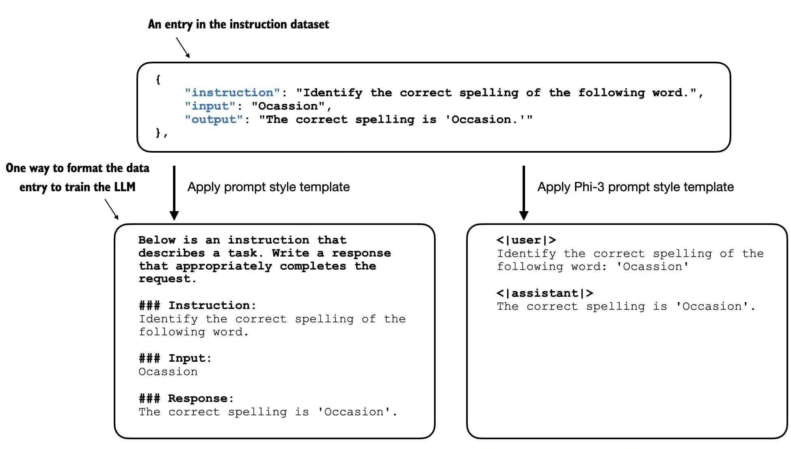

# Projet final Data engineering 2
Dans ce README vous trouverez toutes les informations relatives à l'execution de notre projet ainsi qu'une analyse de notre projet et des problématiques que nous avons eues (il s'agit de notre [Developper Guide](#developper-guide)).
## Préambule
Ce projet est sous la forme d'un jupyter notebook (fichier llm.ipynb), l'objectif est de fine tuner (adaptation d'un modèle préentraîné) un modèle GPT-2 préentraîné pour le rendre spécialisé dans la réponse aux questions sur les maladies, leurs symptômes et leurs traitements.

Nos données sont disponible sur ce [Google Drive](https://drive.google.com/drive/folders/1ya6r4ZSbsnuo_fUUQY6VPzajpZvJis5d), Nous avons récupérer notre dataset sur le github public de [nishantkushwaha-1999](https://github.com/nishantkushwaha-1999/llm_fine_tuning_optimization): 

## Developper Guide

notre code est séparé en plusieurs parties : 

-  La transformation des données
-  Le formatage des données
-  Fine tuning du modèle
-  Evaluation et résultats

### Transformation des données

Dans cette partie du code nous avons tout simplement mis en forme nos données, le but était de faire en sorte qu'elles soient simples à comprendre pour notre modèle.

Pour cela nous avons utilisé le alcapa style format qui est un format reconnu.

Ce format est régulièrement utilisé pour fine-tuner des modèles de langage. Il suit la structure suivante :

- Instruction : la consigne donnée au modèle
- Input : des informations supplémentaires pour répondre à l'instruction (l'input est facultatif)
- Output : la réponse qui est attendue

Voici un schéma du style alpaca

### Formatage des données

Dans cette partie nous avons converti nos données dans le format alpaca-style.

Nous avons ensuite divisé nos données en trois data loaders (un d'entrainement, un de validation et un de test)

Notre ensemble d'entrainement contient toutes les données car il ne peut pas inventer ou faire des prédictions en fonction des autres données.

### Fine tuning du modèle

commence aux data loaders (téléchargement du gpt2)

### Evaluation et résultats
après l'entrainement (la ou on teste les réponses générées)