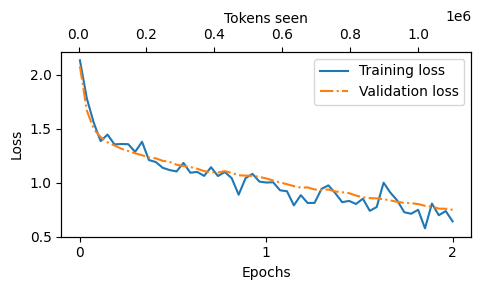
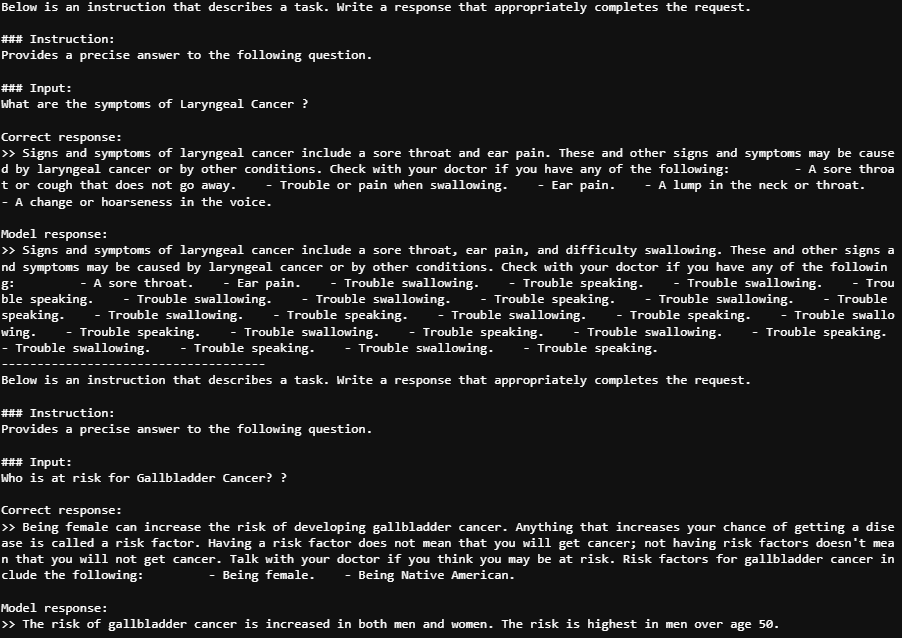
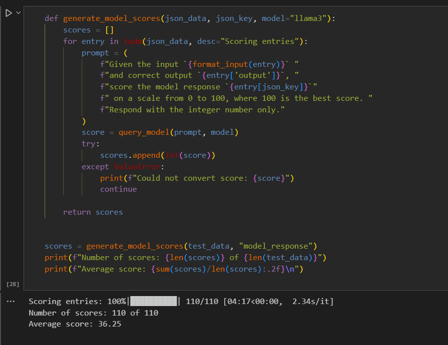

# Projet final Data engineering 2
Dans ce README vous trouverez toutes les informations relatives à l'execution de notre projet ainsi qu'une analyse de notre projet et des problématiques que nous avons eues (il s'agit de notre [Developper Guide](#developper-guide)).
## Préambule
Ce projet est sous la forme d'un jupyter notebook (fichier llm.ipynb), l'objectif est de fine tuner (adaptation d'un modèle préentraîné) un modèle GPT-2 préentraîné pour le rendre spécialisé dans la réponse aux questions sur les maladies, leurs symptômes et leurs traitements.

Nos données sont disponible sur ce [Google Drive](https://drive.google.com/drive/folders/1ya6r4ZSbsnuo_fUUQY6VPzajpZvJis5d), Nous avons récupérer notre dataset sur le github public de [nishantkushwaha-1999](https://github.com/nishantkushwaha-1999/llm_fine_tuning_optimization): 

Il est important de préciser que ce projet demande énormément de ressources et peut prendre plusieurs heures à s'exécuter en entier.

## Developper Guide


notre code est séparé en plusieurs parties : 

-  La transformation des données
-  Le formatage des données
-  Fine tuning du modèle
-  Evaluation et résultats


### Transformation des données

Dans cette partie du code nous avons tout simplement mis en forme nos données, le but était de faire en sorte qu'elles soient simples à comprendre pour notre modèle.

Pour cela nous avons utilisé le alcapa style format qui est un format reconnu.

Ce format est régulièrement utilisé pour fine-tuner des modèles de langage. Il suit la structure suivante :

- Instruction : la consigne donnée au modèle
- Input : des informations supplémentaires pour répondre à l'instruction (l'input est facultatif)
- Output : la réponse qui est attendue

Voici un schéma du style alpaca

### Formatage des données

Dans cette partie nous avons converti nos données dans le format alpaca-style.

Nous avons ensuite divisé nos données en trois data loaders (un d'entrainement, un de validation et un de test)

Notre ensemble d'entrainement contient toutes les données car il ne peut pas inventer ou faire des prédictions en fonction des autres données.

Nous avons ensuite développé une fonction "collate" personnalisée que l'on peut passer au data loader. 

Une fonction collate prend généralemnet une liste d'échantillons tels que des phrases tokenisées afin de les transformer en un seul batch structuré. Cela à plusieurs avantages tels que : 
- Gérer les tailles variables des séquences
- Accélérer l'entrainement en regroupant plusieurs échantillons
- Préparer les données pour le modèle

La fonction permet d'ajouter du padding afin d'aligner les longueurs, générer des tensors de même taille et enfin déplacer les données vers le cpu.

Déplacer les données vers le cpu au lieu de le faire dans la boucle d'entrainement principale permet d'améliorer l'efficacité, cela peut être effectué comme un precessus de fond lorsequ'on utilise la fonction "custom_collate_fn" comme une partie du chargeur de données. Cela permet également d'optimiser les performances et donc de réduire le temps que le modèle prends à apprendre. 

Nous nous sommes assurés que tous nos batchs avaient une longueur différente. 

Enfin nous avons téléchargé le modèle pré-entrainé GPT2 avec 355 million de parametres. 

Bien sur nous avons testé le modèle avant le fine-tuning afin d'évaluer sa capacité à répondre aux questions avant que nous le spécialisions et nous avons remarqué qu'il était mauvais. Cette observation est normale puisqu'il n'est pas encore entrainé sur nos données. 

### Fine tuning du modèle
Dans cette partie nous avons effectué le fine tunning.


Nous avons lancé le fine tunning sur 2 epochs. Il est important de préciser que cette étape est extrêmement longue. Sur nos pcs cela à pris près de 3h.

Une fois le fine tuning nous avons observé que notre modèle s'entraine bien, en effet les pertes d'entrainement et de validation étaient en baisse. De plus nous avons remarqué que le modèle suit correctement l'instruction qui était de convertir la phrase d'entrée en voix passive, exemple : 

```
"Le chef cuisine le repas tous les jours"
```
devient : 
```
"Le repas est cuisiné tous les jours par le chef"
```

Ici nous pouvons voir une courbe qui montre le training loss et le validation loss


### Evaluation et résultats
Dans cette partie nous avons annalisé et évalué les résultats.

pour faire cela nous avons comparé la réponse générée à la réponse attendue, voici quelques exemples de résultats que l'on à eus :




nous remarquons plusieurs choses, les réponses peuvent sembler etranges, en effet certaines fois le modèle se répète dans se réponse et n'arrive pas à tout dire, certaines fois il peut se tromper. Cependant le résultat se rapproche relativement souvent de la réponse attendue. 

Bien sur nous ne pouvons pas faire une généralitée avec un aussi petit échantillon de réponses. C'est pour cela que nous avons généré une réponse pour chaque échantillons de notre dataset de test afin de comparer la réponse générée avec la réponse attendue. 
Pour cela nous avons généré un fichier json qui contient pour chaque réponse la réponse générée et celle attendue. 

Bien sur nous avons enregistré le modèle afin de ne pas avoir à relancer le fine-tuning à chaque fois.

Afin d'évaluer les performances de notre modèle nous avons utilisé le modèle llama3 provenans de ollama.
(pour executer cette partie du code il faut installer ollama sur son pc).

Ici nous avons le score de notre modèle :


Ce score est relativement bas cependant il est plutot encourageant car comme nous pouvons le constater dans notre dataset les réponses sont très longues ce qui nous a forcé à faire des ajustements. En effet afin d'éviter un fine tuning trop long et trop exigeant en terme de cpu et gpu nous avons du réduire la longueur maximum des échantillons, en effet nous l'avons mise à 512 or la plupart des réponses dépassent cette longueur ce qui représente une grande perte d'informations entre la réponse générée et celle attendue. 

De plus en raison des performances limitées de nos pcs nous avons étés obligés de réduire la taille du dataset (1100 échantillons au lieu de 4000). Enfin si l'on avait eu accès à des ordinateurs plus performant nous aurions peut-être pus utiliser le dataset medquad (du meme github que notre dataset actuel) qui contient plus de 16000 échantillons.

## Conclusion

En conclusion nous pouvons constater que malgré les faibles performances de notre modèle nous sommes malgré tout optimiste quand à son potentiel. En effet comme nous l'avons dit nous étions limités en raison des capacités de nos ordinateurs. C'est pour cela que nous pensons que si il avait été pour l'école de nous obtenir un accès à google colab pro ou à une solution équivalente, nous aurions alors eu de meilleurs résultats.

Cependant cette unité à été l'occasion pour nous de faire un projet très intéréssant et motivant.


## Auteurs

Lindeberg Adrien, Ugolini Grégoire